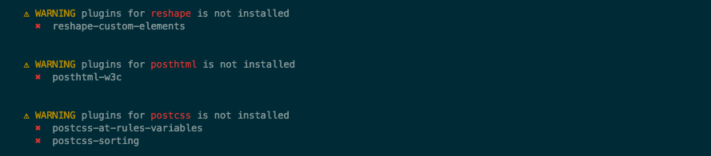

# post-load-plugins

> Automatically detects processor and creates a configuration for used the plugins.

[](https://travis-ci.org/post/post-load-plugins)[](https://ci.appveyor.com/project/GitScrum/post-load-plugins)[]()[](https://www.npmjs.com/package/post-load-plugins)[](https://david-dm.org/post/post-load-plugins)[](https://github.com/sindresorhus/xo)[](https://coveralls.io/r/post/post-load-plugins)

[](https://www.npmjs.com/package/post-load-plugins)[](https://www.npmjs.com/package/post-load-plugins)[](http://packagequality.com/#?package=post-load-plugins)

## Why?
Automatically detects the running environment on the basis of which creates the configuration for plugins using [post-config](https://github.com/post/post-config) used in the process and sorts the execution order of plugins using [post-sequence](https://github.com/GitScrum/post-sequence).

[**post-config**](https://github.com/post/post-config) - Automatically detect all plugins installed and create a configuration for them from the description in package.json used in the process.

[**post-sequence**](https://github.com/GitScrum/post-sequence) - Generates the correct sequence of execution of plug-ins for the executable  

**At the moment the tested processors:**

<a href="https://github.com/posthtml/posthtml"></a>|<a href="https://github.com/reshape/reshape"></a>|<a href="https://github.com/postcss/postcss"></a>|
---|---|---|

**Will inform you if the plugin has not been installed:**  


## Install

```bash
$ npm install post-load-plugins 
```
> **Note:** This project is compatible with node v4+
 

## Usage

1. Install processor [PostHTML](https://github.com/posthtml/posthtml) or [PostCSS](https://github.com/postcss/postcss) or both and post-load-plugins
  ```bash
  $ npm install postcss posthtml post-load-plugins 
  ```

2. Install plugins for your processor
  ```bash
  $ npm install autoprefixer postcss-at-rules-variables postcss-csso posthtml-bem posthtml-beautify
  ```

3. **`Optional`** Create configuration for plugins is different from the default in package.json.  
  > For plugins not having configuration installed locally will be used default settings.  

  ```json
  "postcss":{
    "plugins": {
      "autoprefixer": {
        "browsers": ["last 2 versions"]
      },
      "at-rules-variables": {
        "atRule": ["@media"]
      }
    }
  },
  "posthtml": {
    "bem": {
      "elemPrefix": "__",
      "modPrefix": "--",
      "modDlmtr": "-"
    }
  }
  ```  

> Attention, it is recommended to use notation as above for postcss `postcss: { plugins: { ... } }`, but both types are supported notation `posthtml: { bem: { ... }, plugins: { beautify: { ... } } }`. 

> The names of the plugins it is recommended to use no name of the processor as described above for postcss, but supported the full name of the plugin, the plugin name without the process in kebab `at-rules-variables` and camel case `atRulesVariables`.


## Example
### using [PostCSS](https://github.com/postcss/postcss)
package.json
```json
"name": "my-post-project",
"devDependencies": {
    "autoprefixer": "^6.5.4",
    "postcss": "^5.2.6",
    "postcss-csso": "^1.1.2"
},
"postcss":{
  "plugins": {
    "autoprefixer": {
      "browsers": ["last 2 versions"]
    }
  }
}
```
index.js
```js
import postcss from 'postcss';
import postLoadPlugins from 'post-load-plugins';

postcss(postLoadPlugins()).process('.test { display: flex; color: #ff0000;} @charset "utf-8";');
// Result => .test{display:-ms-flexbox;display:flex;color:red}
 ```
 *Will apply `autoprefixer` with option described in the configuration `"browsers": ["last 2 versions"]` and `postcss-csso` with default settings*

--  

### using [PostHTML](https://github.com/posthtml/posthtml)
 
package.json
```json
"name": "my-post-project",
"devDependencies": {
    "posthtml": "^0.9.0",
    "posthtml-bem": "^0.2.2",
    "posthtml-beautify": "0.1.0"
},
"posthtml": {
  "bem": {
    "elemPrefix": "__",
    "modPrefix": "--",
    "modDlmtr": "-"
  }
}
```

index.js
```js
import posthtml from 'posthtml';
import postLoadPlugins from 'post-load-plugins';

const html = `
  <div block="content">
    <h1 elem="title">Title</h1>
    <p elem="text" mods="red">Text</p>
  </div>
`;

posthtml(postLoadPlugins()).process(html);
//  Result =>
//  <div class="content">
//    <h1 class="content__title">Title</h1>
//
//    <p class="content__text content__text--red">Text</p>
//  </div>
 ```

*Will apply `posthtml-bem` with option described in the configuration `"elemPrefix": "__","modPrefix": "--","modDlmtr": "-"` and `posthtml-beautify` with default settings*  

## Options
#### `extends`  
Type: `Array`  
Default: `[]`  
Description: *May contain an `Object` with properties or `path` to config for the expansion*

extend.config.json
```json
"bem": {
  "modPrefix": "---"
}
```  
*Will automatically try to determine if you do not specify a process name in the package name or the package does not reside in the property matching process*

index.js
```js
import posthtml from 'posthtml';
import postLoadPlugins from 'post-load-plugins';

const html = `
  <div block="content">
    <h1 elem="title">Title</h1>
    <p elem="text" mods="red">Text</p>
  </div>
`;

posthtml(postLoadPlugins({extends: ['path/to/file/extend.config.json']})).process(html);

//  Result =>
//  <div class="content">
//    <h1 class="content__title">Title</h1>
//
//    <p class="content__text content__text---red">Text</p>
//  </div>
```
*Expand the current configuration for posthtml plugins bem*
